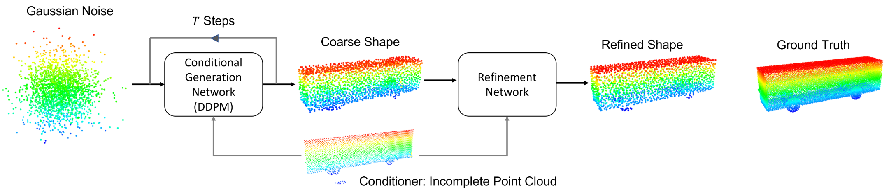
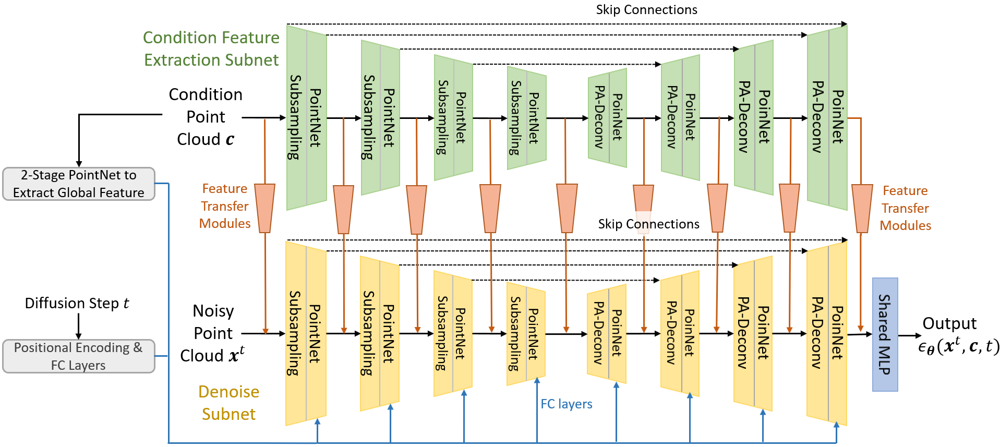

# A Conditional Point Diffusion-Refinement Paradigm for 3D Point Cloud Completion
This repo intends to release code for our work: 

Zhaoyang Lyu\*, Zhifeng Kong\*, Xudong Xu, Liang Pan, Dahua Lin, ["A Conditional Point Diffusion-Refinement Paradigm for 3D Point Cloud Completion"](https://arxiv.org/pdf/2112.03530.pdf).

\* Equal contribution


The Point Diffusion-Refinement (PDR) Paradigm is a point cloud completion method based on conditional Denoising Diffusion Probabilistic Models (DDPM). We use DDPM to generate a coarse complete point cloud conditioned on the partial point cloud. Then we use another refinement network to refine the coarse point cloud generated by the DDPM. The paradigm is shown in the figure below. 



We design a novel dual-path architecture for both the conditional generation network (DDPM) and the refinement network:



# Set up the environment
The code is tested with Pytorch 1.7.1, CUDA 10.1, and gcc 5.5.0. 
First create an environment named pdr
```
conda create --name pdr
conda activate pdr
```
Then run the following command to install and build all the required packages.
```
bash setup_env.sh
```

# Run point cloud completion experiments on the MVP dataset
All point cloud completion experiments will be run in the folder `pointnet2`.
## Preprocess the data
You may download the original [MVP dataset](https://paul007pl.github.io/projects/VRCNet.html) from [Dropbox](https://www.dropbox.com/sh/la0kwlqx4n2s5e3/AACjoTzt-_vlX6OF9mfSpFMra?dl=0&lst=) or [Google Drive](https://drive.google.com/drive/folders/1ylC-dYFM45KW4K9tPyljBSVyetazCEeH).
You should put all the .h5 files to the folder `mvp_dataloader/data/mvp_dataset`.

Then we preprocess the partial point clouds in the dataset.
We observe that most objects in the MVP dataset have reflection symmetry with respect to the xy plane. Therefore, we mirror the partial input with respect to this plane and concatenate the mirrored points with the original partial input. 
We subsample this concatenated point cloud from 4096 points to 3072 points by farthest point sampling to obtain a uniform point cloud.

You may process the partial point clouds by yourself using the file  `mvp_dataloader/generate_mirrored_partial.py`, or download our preprocessed partial point clouds from [here](https://drive.google.com/drive/folders/1s5r61PjcMlqpkgObtwrGow210XfunjRV?usp=sharing).
The downloaded .h5 files should be put to the folder `mvp_dataloader/data/mvp_dataset/mirror_and_concated_partial`.

## Train the Conditional Generation Network (DDPM)
Run the following command to train a conditional Denoising Diffusion Probabilistic Model (DDPM) that can generated a coarse complete point cloud conditioned on a partial point cloud.
```
python distributed.py --config exp_configs/mvp_configs/config_standard_attention_real_3072_partial_points_rot_90_scale_1.2_translation_0.1.json
```
All training settings are specified in the configuration file.
It uses 8 GPUs for training by default. You may change the value `dist_config.CUDA_VISIBLE_DEVICES` to specify the gpus for training.
All the checkpoints, evaluation results, and log files will saved to the folder determined by `train_config.root_directory` and `pointnet_config.model_name`, which is `exp_mvp_dataset_completion/T1000_betaT0.02_shape_completion_mirror_rot_90_scale_1.2_translation_0.1` in this case.
We train the DDPM for 340 epochs and it takes about 5 days on 8 NVIDIA GEFORCE RTX 2080 Ti GPUs. We provide a pretrained DDPM at [here](https://drive.google.com/file/d/1Kyp32RYxUsVqM-lZ2SlMXJfYCkhQVJUJ/view?usp=sharing). You should put the checkpoint to the folder `exp_mvp_dataset_completion/T1000_betaT0.02_shape_completion_mirror_rot_90_scale_1.2_translation_0.1/logs/checkpoint`.

## Use the trained DDPM to generate training data for the Refinement Network.
After training the conditional generation network (DDPM), we need to use it to generate coarse complete point clouds as training data to train the refinement network. In this section, we generate samples using the full 1000-step DDPM for best performance. 
See the next section if you want to generate samples using accelerated DDPM.
### Generate samples for the test set
We first generate coarse complete point clouds for the test set using the trained DDPM. Run the following command:
```
python generate_samples_distributed.py --execute --gather_results --remove_original_files --config exp_configs/mvp_configs/config_standard_attention_real_3072_partial_points_rot_90_scale_1.2_translation_0.1.json --ckpt_name pointnet_ckpt_643499.pkl --batch_size 32 --phase test --device_ids '0,1,2,3,4,5,6,7'
```
It uses multiple gpus to generate coarse complete point clouds by default. You could use the argument `device_ids` to control the gpus to use. You also need to set the argument `ckpt_name` to specify which checkpoint to use to generate point clouds. It takes about 21 hours on 8 NVIDIA GEFORCE RTX 2080 Ti GPUs to generate coarse complete point clouds for the test set.
The command not only generate coarse complete point clouds, but also evaluate the checkpoint's performance on the test set.
The generated coarse complete point clouds and evaluation results will be saved to the folder `mvp_dataloader/data/mvp_dataset/generated_samples/T1000_betaT0.02_shape_completion_mirror_rot_90_scale_1.2_translation_0.1/pointnet_ckpt_643499/test`.

### Generate samples for the training set
Next we generate coarse complete point clouds for the training set. 
As mentioned in the paper, we need to generate 10 coarse point clouds for each partial point cloud in the training set to increase diversity of training data.
However, if we generate the 10 coarse point clouds all from scratch, it would take too much time.

Note that the generation process of our trained 1000-step DDPM is the reverse denoising process from x^1000 (A pure Gaussian noise) to x^1 (A complete and meaningful point cloud).
In the first generation trial, we save not only the generated complete point cloud x^1, but also the intermediate point cloud x^100.
In the following trials, we generate complete point cloud from the previously saved x^100, instead of x^1000.
This trick greatly reduces the generation time, in expense of some diversity in the generated point clouds.

First run the following command:
```
python generate_samples_distributed.py --execute --gather_results --remove_original_files --config exp_configs/mvp_configs/config_standard_attention_real_3072_partial_points_rot_90_scale_1.2_translation_0.1.json --ckpt_name pointnet_ckpt_643499.pkl --batch_size 32 --phase test_trainset --save_multiple_t_slices --t_slices '[100]' --device_ids '0,1,2,3,4,5,6,7'
```
This command generates 1 complete point cloud for each partial point cloud in the training set. It saves not only the generated complete point cloud x^1, but also the intermediate point cloud x^100.
Generated coarse complete point clouds and evaluation results will be saved to the folder `mvp_dataloader/data/mvp_dataset/generated_samples/T1000_betaT0.02_shape_completion_mirror_rot_90_scale_1.2_translation_0.1/pointnet_ckpt_643499/train`.

Next run 
```
python generate_samples_distributed.py --execute --gather_results --remove_original_files --config exp_configs/mvp_configs/config_standard_attention_real_3072_partial_points_rot_90_scale_1.2_translation_0.1.json --ckpt_name pointnet_ckpt_643499.pkl --batch_size 32 --phase test_trainset --use_a_precomputed_XT --T_step 100 --XT_folder mvp_dataloader/data/mvp_dataset/generated_samples/T1000_betaT0.02_shape_completion_mirror_rot_90_scale_1.2_translation_0.1/pointnet_ckpt_643499 --augment_data_during_generation --augmentation_during_generation '1.2; 90; 0.5; 0.1' --num_trials 10 --device_ids '0,1,2,3,4,5,6,7'
```
It utilizes previously generated x^100 to generate 10 complete point clouds for each partial point cloud in the training set. We need to specify the location of the previously saved x^100 through the argument `XT_folder`.
Generated coarse complete point clouds and evaluation results will be saved to the folders `mvp_dataloader/data/mvp_dataset/generated_samples/T1000_betaT0.02_shape_completion_mirror_rot_90_scale_1.2_translation_0.1/pointnet_ckpt_643499/trial_{1-10}`.

## Generate point clouds by fast sampling
In the above section, we use the full 1000-step DDPM to generate training data for the refinement network, but it takes lots of time. As mentioned in our paper, we could also generate point clouds using an accelerated DDPM in fewers steps, and then train another refinement network to refine these point clouds.
We use the acceleration strategy proposed in [FastDPM](https://github.com/FengNiMa/FastDPM_pytorch).

Below we demonstrate how we can use a 50-step DDPM to generate coarse point clouds.
Run the following command to generate coarse point clouds for the test set:
```
python generate_samples_distributed.py --execute --gather_results --remove_original_files --config exp_configs/mvp_configs/config_standard_attention_real_3072_partial_points_rot_90_scale_1.2_translation_0.1.json --ckpt_name pointnet_ckpt_643499.pkl --batch_size 32 --phase test --device_ids '0,1,2,3,4,5,6,7' --fast_sampling --fast_sampling_config '50; var; quadratic; 0.5'
```
It takes about 1 hour on 8 NVIDIA GEFORCE RTX 2080 Ti GPUs.
Samples will be saved to `mvp_dataloader/data/mvp_dataset/generated_samples/T1000_betaT0.02_shape_completion_mirror_rot_90_scale_1.2_translation_0.1/pointnet_ckpt_643499/fast_sampling/fast_sampling_config_length_50_sampling_method_var_schedule_quadratic_kappa_0.5/test`.

Next we generate coarse point clouds without data augmentation for the training set:
```
python generate_samples_distributed.py --execute --gather_results --remove_original_files --config exp_configs/mvp_configs/config_standard_attention_real_3072_partial_points_rot_90_scale_1.2_translation_0.1.json --ckpt_name pointnet_ckpt_643499.pkl --batch_size 32 --phase test_trainset --device_ids '0,1,2,3,4,5,6,7' --fast_sampling --fast_sampling_config '50; var; quadratic; 0.5'
```
Samples will be saved to `mvp_dataloader/data/mvp_dataset/generated_samples/T1000_betaT0.02_shape_completion_mirror_rot_90_scale_1.2_translation_0.1/pointnet_ckpt_643499/fast_sampling/fast_sampling_config_length_50_sampling_method_var_schedule_quadratic_kappa_0.5/train`.

Finally we generate 10 trials coarse point clouds with data augmentation for the training set:
```
python generate_samples_distributed.py --execute --gather_results --remove_original_files --config exp_configs/mvp_configs/config_standard_attention_real_3072_partial_points_rot_90_scale_1.2_translation_0.1.json --ckpt_name pointnet_ckpt_643499.pkl --batch_size 32 --phase test_trainset --device_ids '0,1,2,3,4,5,6,7' --fast_sampling --fast_sampling_config '50; var; quadratic; 0.5' --augment_data_during_generation --augmentation_during_generation '1.2; 90; 0.5; 0.1' --num_trials 10 
```
Samples will be saved to `mvp_dataloader/data/mvp_dataset/generated_samples/T1000_betaT0.02_shape_completion_mirror_rot_90_scale_1.2_translation_0.1/pointnet_ckpt_643499/fast_sampling/fast_sampling_config_length_50_sampling_method_var_schedule_quadratic_kappa_0.5/trial_{1-10}`


## Train the Refinement Network
### Refine coarse point clouds generated by the full 1000-step DDPM
We can train the refinement network using training data generated by the trained DDPM.
Run 
```
python distributed.py --config exp_configs/mvp_configs/config_refine_standard_attention_10_trials.json
```
All the checkpoints, evaluation results, and log files will saved to the folder `exp_mvp_dataset_completion/T1000_betaT0.02_shape_completion_mirror_rot_90_scale_1.2_translation_0.1/refine_exp_ckpt_643499_standard_attention_10_trials`.
Note that we have specified the location of the DDPM generated coarse complete point cloud in the argument `mvp_dataset_config.generated_sample_path`.
We provide a pretrained refinement network at [here](https://drive.google.com/file/d/1G8wj6PahwjE7mAN5FKQJi-yP6SW1pqQY/view?usp=sharing). You should put the checkpoint to the folder `exp_mvp_dataset_completion/T1000_betaT0.02_shape_completion_mirror_rot_90_scale_1.2_translation_0.1/refine_exp_ckpt_643499_standard_attention_10_trials/logs/checkpoint`.

If you want to evaluate the checkpoint's performance on the mvp dataset, first make sure you have used the trained DDPM to generate coarse complete point clouds for the test set and training set, then run the following command to test the checkpoint on the test set:
```
python generate_samples_distributed.py --execute --gather_results --remove_original_files --config exp_configs/mvp_configs/config_refine_standard_attention_10_trials.json --ckpt_name pointnet_ckpt_120899_best_cd.pkl --batch_size 32 --phase test --device_ids '0,1,2,3,4,5,6,7'
```
The refined point clouds and evaluation results will be saved to `mvp_dataloader/data/mvp_dataset/generated_samples/T1000_betaT0.02_shape_completion_mirror_rot_90_scale_1.2_translation_0.1/refine_exp_ckpt_643499_standard_attention_10_trials/pointnet_ckpt_120899_best_cd/test`.

Run the following command to test the checkpoint on the training set:
```
python generate_samples_distributed.py --execute --gather_results --remove_original_files --config exp_configs/mvp_configs/config_refine_standard_attention_10_trials.json --ckpt_name pointnet_ckpt_120899_best_cd.pkl --batch_size 32 --phase test --device_ids '0,1,2,3,4,5,6,7'
```
The refined point clouds and evaluation results will be saved to `mvp_dataloader/data/mvp_dataset/generated_samples/T1000_betaT0.02_shape_completion_mirror_rot_90_scale_1.2_translation_0.1/refine_exp_ckpt_643499_standard_attention_10_trials/pointnet_ckpt_120899_best_cd/train`.

The refinement network refines the 2048 points generated by the trained DDPM by default. We also provide the configuration files that perform upsampling experiments in the folder `exp_configs/mvp_configs`.
For example, if you want to refine and upsample the DDPM generated coarse points from 2048 to 16384, you could run the following command:
```
python distributed.py --config exp_configs/mvp_configs/config_refine_and_upsample_16384_pts_standard_attention_10_trials.json
```

### Refine coarse point clouds generated by the accelerated 50-step DDPM
Run the following command to refine coarse point clouds generated by the accelerated 50-step DDPM:
```
python distributed.py --config exp_configs/mvp_configs/config_refine_standard_attention_10_trials_fast_sampling_length_50.json
```
All the checkpoints, evaluation results, and log files will be saved to the folder `exp_mvp_dataset_completion/T1000_betaT0.02_shape_completion_mirror_rot_90_scale_1.2_translation_0.1/refine_exp_ckpt_643499_standard_attention_10_trials_fast_sampling_length_50`.

# Acknowledgement
This repo is inspired by and adapted from [Pointnet2_PyTorch](https://github.com/erikwijmans/Pointnet2_PyTorch).

